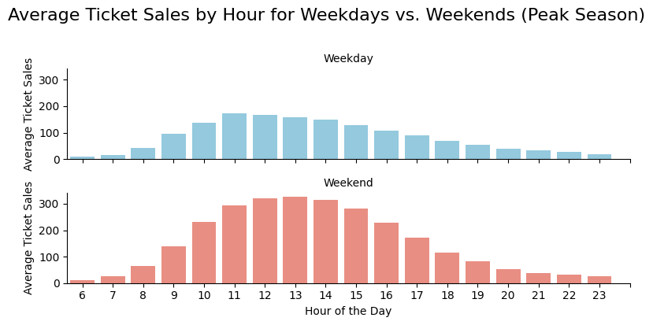

I am using the [*Toronto Island Ferry Ticket Counts*](https://open.toronto.ca/dataset/toronto-island-ferry-ticket-counts/) data from Toronto's Open Data Catalogue. 

The first visualization was completed in **Python** and the code can be found in `appendix.ipynb`. I am using `seaborn` for the visualization in Python.

This plot shows average ticket sales by hour on weekdays (top plot) and weekends (bottom plot) during peak season (May through September). I excluded data from 2020 and 2021 because the ferry was not running full service between March 2020 and August 2021 due to COVID and I wanted to ensure the plot reflected "regular" data. I also am only displaying data between 6 am and midnight because these are typical ferry hours. The ferry leaves every ~15 minutes, but I have aggregated data within the hour for simplicity, as I feel this is fine-grained enough for the typical visitor looking to use this visualization.

The intended audience of this plot is individuals who would like to visit Toronto Island between May and August, inclusive. The idea was to have a Google Maps-style "Popular Times" plot (i.e., when you look a location up on Google Maps and see live and historical trends of how busy a place is).

The plot conveys the typical peak times of travel to the island, where higher bars convey busier times. I broke it down further by weekdays and weekends since peak times and average sales will be different between the two, where visitors/tourists will be more likely to go on weekends and at different time periods than those using the ferry throughout the week.

I strongly considered all three qualities of data visualization in my plot, with the intention of informing my audience. Aesthetically, I wanted to have a very clean and simple figure displaying the basic information without any frills. I tweaked the colours between the plots to ensure readers realize these are different groups of data (i.e., weekdays and weekends), which may be redundant but I think will ultimately help guide attention to distinguishing them. Substantively, I believe this accurately and honestly presents the data by averaging sales over the peak season and not including COVID data. Perceptually, I wanted to ensure the message was very clear: Higher peaks mean busier times. The simplicity and familiarity of this chart (especially alongside the Google Maps Popular Times plot, which I use often) should make this a very low-effort plot to read while still sharing key information to inform individuals' travel plans. Finally, I made sure that my axes are well-labelled, proportionate to the custom plot size, and simple to understand.

This is an open data set and I've used Python and free, available packages to plot this data. As such, this plot is completely reproducible.

I believe the plots are accessible and user-friendly, as the colours don't really matter and aren't compared within the same plot, and the key trend to look at is the height of the bar plots. I've also added alternative text to the image within this document to enhance accessibility.

Anyone who is looking to visit Toronto Island during peak season via the ferry will benefit from this visualization to inform their travel plans. The information is displayed this way to help inform readers in case they have flexibility and would like to avoid peak times (i.e., avoiding crowds, increasing their chances of obtaining a ferry ticket and avoiding tickets selling out at peak times...). 

I wanted to ensure the values presented here were reflective of ferry use during nicer weather, i.e., peak season (May-September, inclusive). I also wanted to forego the COVID data as those would have heavily skewed the results. I considered doing a day-by-day visualization, but the patterns were incredibly similar across weekdays and weekends, so I opted to aggregate them further.

A few unseen contributions went into the dataset here. For example, community organizers, workers, and IT support needed to develop a system to track this data in real-time from the ferry terminal transactions to real-time updates on the data page. 