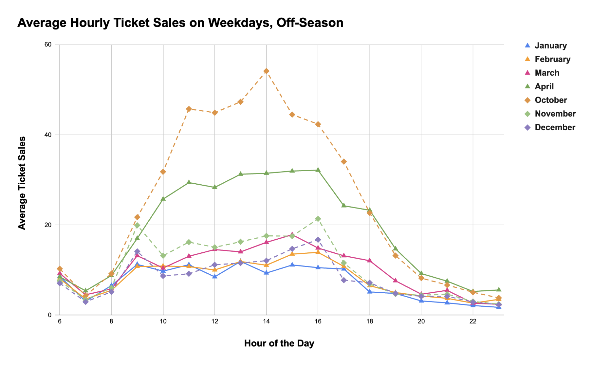

I am using the [*Toronto Island Ferry Ticket Counts*](https://open.toronto.ca/dataset/toronto-island-ferry-ticket-counts/) data from Toronto's Open Data Catalogue. 

The second visualization was completed in Google Sheets. This visualization shows the average hourly ticket sales on **weekdays only** during off-season (October through April) and again excludes COVID data (years 2020 and 2021).

Please see [this link](https://docs.google.com/spreadsheets/d/15TgDegnabGy7TyMGpcRROVADanFrNxiVUa666JtaWhg/edit?usp=sharing) for the openly-shared Google Sheets data.

My intended audience is city employees that can use this data to inform their decisions of ferry scheduling on weekdays in the future. The off-season scheduling is very important as some Toronto residents live in the Island, and it needs to be an accessible route.

I am trying to show the peak times, by month, for ticket sales. Notably, few sales occur between 6-8 am and after 7 pm, and this may be a time where city employees may decide to reduce ferry service (e.g., from every 15 minutes to every 30 minutes).

Aesthetically, I was considering proximity of the data. Because each line represents an off-season month, there is quite a bit of information in this plot. Thus, it's important to distinguish these lines from each other. I tried to do this by differentiating using salient colours and dotted lines for the end-of-year months (October-December) and solid lines for start-of-year months (January-April), and these two groups also have different point shapes (triangle for early months, diamond for later months). I wasn't able to display the dotted vs solid lines in the legend, which is why I opted to also include the shapes. More holistically, I wanted to use a line plot because this emulates time series in a more typical manner than bar plots do, and because the intended audience would be interested in the ebb and flow of day. As before, I wanted to make sure the plot was simple and clean so the audience can focus on the main communication.

As before, this is an open data set and I've used Google Sheets and free, available packages to plot this data. As such, this plot is completely reproducible, and if asked by a colleague, I would be able to share the Google Sheets document.

Because there's quite a bit of data in this plot, I used several features - not just colour - to differentiate the lines. I selected most colours from [**here**](https://venngage.com/tools/accessible-color-palette-generator). I used some slight shade alterations (e.g., the green lines) because I didn't want to use several different colours, which is why I also included a dotted line and shape variation. (I apologize for the dotted line not showing up - again, I'm not sure how to do that, but would have known how to do it in Python/ggplot2...)

Beyond the employees who would use my visualization, the Toronto Island residents would be affected by changes in scheduling (i.e., increases or decreases in ferry service off-season on weekdays). It would also affect those who choose to visit the Island at these times.

As before, I wanted to ensure the values presented here showed off-season use (i.e., not tourism use, compared to the previous plot). I also wanted to forego the COVID data as those would have heavily skewed the results. Finally, I only include weekday data as, for example, employees can see the typical patterns of residents and workers on the island to ensure increased service during peak times and perhaps save resources during down times.

A few unseen contributions went into the dataset here. For example, community organizers, workers, and IT support needed to develop a system to track this data in real-time from the ferry terminal transactions to real-time updates on the data page. 
